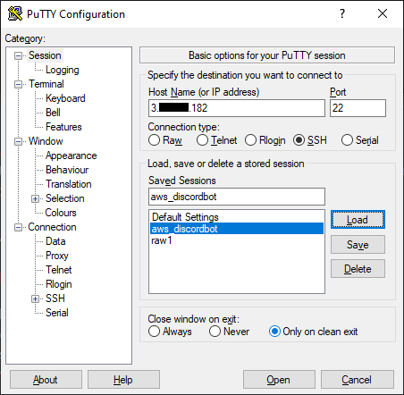
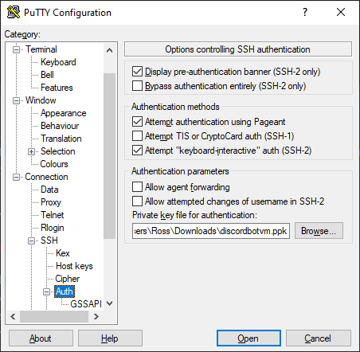
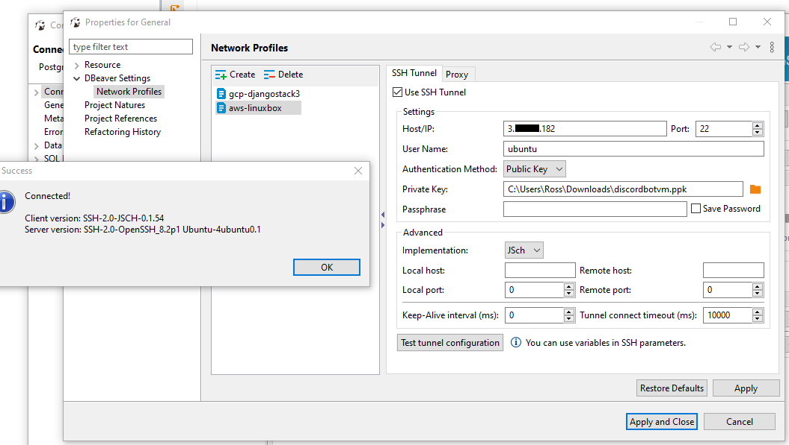

# Discord_Bot

## Continuous Delivery:

Commits are automatically deployed to AWS servers. This uses Github Actions, viewable at ./Discord_Bot/.github/workflows/

Secrets stored in Github used for these scripts:

 - HOST - External IP address of EC2 instance.
 - USERNAME - username for amazon EC2 instance.
 - KEY - Text of .ppk key used for SSH authentication 
 - PORT - 22
 - JARVIS - Discord bot API key for master branch, associated Discord user is on the **real** server.
 - BARVIS - Discord bot API key for bot #2, (any branch under active development) associated Discord user is on **test** server.
 - NARVIS - Discord bot API key for bot #3, (any branch under active development) associated Discord user is on **test** server.
 - xARVIS - Feel free to add additional API keys as needed. Ideally we'd have one per branch.

## Creating a new branch:

Generally a new branch is associated with a new Discord bot account/username for testing purposes. To get the new branch its own username, complete the following steps:

 1. Go to the Discord Developer Portal ( https://discord.com/developers/applications/ ) and create a "New Application". Give it a relevant name that lets you identify which application and which branch it is. 
 2. Click the "Bot" tab.
 3. Click the "Add Bot" button. Confirm by clicking the "Yes, do it!" button.
 4. Toggle the "Presence Intent" to the ON position.
 5. Toggle the "Server Members Intent" to the ON position.
 6. Click the green "Save Changes" button at the bottom of the window.
 7. In the sidebar, click the OAuth2 tab.
 8. Toggle (check ✅) the "bot" flag to  in the Scopes tool.
 9. Toggle (check ✅) the "Administrator"  flag in the "Bot Permissions" tool.
 10. Click the "Copy" button in the Scopes tool.
 11. Paste that link into a new tab.
 12. Add the bot to one of your testing servers.
 Repeat steps 11 and 12 until it is added to all relevant testing servers.
 13. Again in the "Bot" tab of the Discord Developer Portal sidebar for your selected app, click the "Click to Reveal Token" link and/or the "Copy" button underneath Token, and copy the API token for your bot.
 14. At https://github.com/Super-COSC-Kids/Discord_Bot, click "Settings" near the top repository navigation menu.
 15. In the sidebar navigation, click "Secrets".
 16. Near the top of the main window pane, click the "New repository secret" button.
 17. Name your new secret something in all CAPS (no spaces) which is relevant to the branch. For example "LOGGINGBRANCH".
 18. Paste the API token into the "Value" field.
 19. Click the "Add secret" button.
 20. Create a new branch, ideally named after the feature you envision adding, or the bug you are working to fix.
 21. Edit the readme.md at the root of the branch with the following format:
      ```md
        # [name of branch] branch
    
        ## What is the intention for the [feature/bug]?
        
         [Detailed explanation of what "done" looks like for this branch]
        
        ## Primary maintainers of the roles_command branch:
        
         - [Your name here]
         - [Collaborator names]
         
        ## Todo list:
       
         - [Specific Task #1]
         - [Specific Task #2]
         - [Specific Task #3]
        ``` 
 22. Currently all the branches deploy to `~/Discord_Bot/[branchdir]`. Determine a name for `branchdir` such as `~/Discord_Bot/loggingbot`.
 23. Edit `startup.sh` to change `COSCY` (on lines 2 and 3), and `node ~/Discord_Bot/COSCYBOT/main.js &` on line 6 to your `[branchdir]`. Example:
      ```sh
      #!/bin/bash
      if pgrep -f "node.*loggingbot"
       then kill "$(pgrep -f "node.*loggingbot")"
      fi
      sleep 5
      node ~/Discord_Bot/loggingbot/main.js &
      ```
 24. Push this new branch (with edited `./readme.md` and `./shartup.sh`) to the GitHub repo.
 25. Using the GitHub website UI, navigate to `https://github.com/Super-COSC-Kids/Discord_Bot/blob/[branchname]/.github/workflows/scp_ssh.yml` (with your branch replacing the `[branchname]` placeholder in this URL)
 26. Edit this file using the GitHub website UI:
     - On line 17, replace `target: "COSCYBOT"` with your `[branchdir]`.
     - On line 28, replace `{{ secrets.COSCYBOT }}` with the name of the secret you created in step 17, ex: `export COSCYBOT=${{ secrets.LOGGINGBRANCH }}`
     - On line 35, replace `sh Discord_Bot/COSCYBOT/startup.sh` with the directory you specified in step 22/23. Ex: `sh Discord_Bot/loggingbot/startup.sh`
     - On lines 27, 34, and 36, replace `COSCYBOT` with a name you'll recognize for this branch. These files help determine if there was an error generated in the CD pipeline.
 27. Commit these changes, click "Actions" in the top repo navigation bar, and watch the deployment.
 28. Go to your test server in Discord and send the message "+identity" to see if your new branch is running properly.

## Cattle, Not Pets:

Feel free to take your server out back if necessary. To stand up a new server:

1. Create an EC2 Instance based on Amazon's ubuntu image. Current one we're using is ubuntu/images/hvm-ssd/ubuntu-focal-20.04-amd64-server-20200907 (ami-07efac79022b86107) although given the lack of custom configuration, I'd strongly suspect that you will be able to use the latest version for a long time to come.

2. Log into the server and run the following instructions:
```sh
  sudo apt-get install npm
  curl -sL https://deb.nodesource.com/setup_12.x | sudo -E bash -
  sudo apt-get install -y nodejs
  npm install discord.js
  sudo apt-get --yes install postgresql
  sudo -u postgres createuser {USERNAME}
  sudo su - postgres -c "psql -c 'ALTER USER {USERNAME} SUPERUSER'"
  sudo apt-get install daemontools
```

3. Re-assign the static Elastic IP address from the old server to the new one.

4. Push a new commit, ensure that the new bot builds on the new server and works.

5. Kill the old server.

## How to do stuff:

Most personal workflows should be supported. This is not a very opinionated setup. If your favorite workflow doesn't work, create an issue and let's chat about it.

Most reccomended workflow:

1) Clone the repo. Checkout your branch. Edit -> Commit -> Push.
2) Go to https://github.com/Super-COSC-Kids/Discord_Bot/actions and watch your new code get deployed.
3) Test your new bot.

Need to SSH into the server?

 - IP: Your Elastic IP address.
 - port: `22`
 - user: `ubuntu`
 - Auth Method: `Public Key`
 - Private Key: `discordbotvm_yourname.ppk`
 - Passphrase: I would leave this blank personally and type in every time you connect

In a console, this would typically be done with the following:

`ssh -i "C:\Users\Ross\Downloads\discordbotvm.pem" username@3.xxx.xx.182`

You may have to convert your .ppk key to a .pem key for commandline access. However, you can use the .ppk file directly in PuTTY. Configure the Session screen like this:

<p align="center">
  
</p>

and make sure to use your .ppk file but going to Connection -> SSH -> Auth -> Browse... and selecting the file (or pasting path directly into the input field, of course):

<p align="center">
  
</p>

Here's a screenshot of how to fill these into DBeaver to let it create a tunnel into the server so you can get direct SQL access:
<p align="center">
  
</p>

SSH tunnels are required if you want to run code locally on your own laptop/desktop and interact with the database on the server. 

`ssh -i "C:\Users\Ross\Downloads\discordbotvm_yourname.pem" -L 5432:localhost:5432 username@3.xxx.xxx.182 -N`

This should make the database connection transparent for any versions of the bot running locally on your own machine. This makes it so that anything connecting to "localhost:5432" actually ends up connecting to port 5432 on the remote host but as if it were from localhost on the remote host. The server has no open ports besides 22, and will reject any attempts to connect to it. Furthermore, if requests do get through, the PostgreSQL instance would not allow your user to connect remotely. This SSH tunnel makes PostgreSQL see the connection as coming from "localhost", so it allows the connection the same as one originating from on the server.

Rather than editing local code and tunneling through SSH to the database, I'd reccomend using VSCode for Remote Development:
 - https://code.visualstudio.com/docs/remote/ssh-tutorial
 - https://code.visualstudio.com/blogs/2019/07/25/remote-ssh

Or IntelliJ's similar system (only available on Professional licenses!) The following link is for PyCharm, but WebStorm has similar functionality.
 - https://www.jetbrains.com/help/pycharm/configuring-remote-interpreters-via-ssh.html

Both of these allow your code to run on the remote machine, but gives you the same workflow you're used to on your own computer. It does everything over SCP and SSH but feels exactly like its locally happening on your own computer. It will give you a more consistent experience between dev and prod.

## Logs

output from console.log() and error output (such as occurs when the application crashes) are stored in files for future reference to help with debugging. 

To read the logs with local timezone, run:
  ```cat [path_to_log_file] | tai64nlocal```

Generally the path to the most recent log file is `~/Discord_Bot/[branch_of_interest]/logs/current` so you would run:

```cat ~/Discord_Bot/COSCYBOT/logs/current | tai64nlocal``` to read the most recent logfile for the main branch.

The command to run the discord bot with logging is:
```node main.js 2>&1 | multilog t s1048576 ./logs/```

## Merge often

Try to close up branches as soon as possible. Merge in any reasonably finalized changes, then rebranch again immediately and continue developing.
